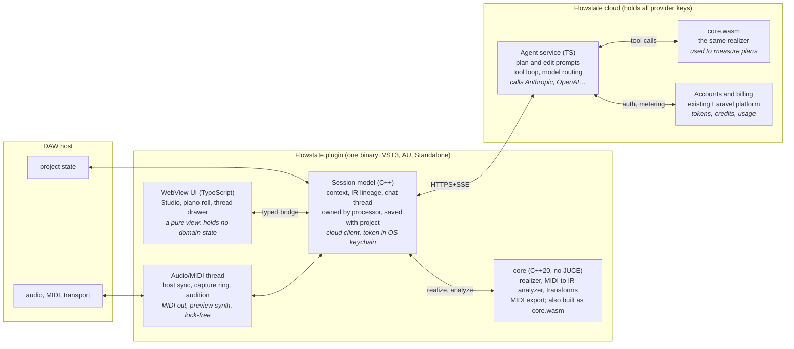

# Flowstate v2: Analysis & Redesign Proposal

Sep 28, 2026 · @FHC Support

> **Living copy.** Converted from the original proposal (a claude.ai artifact, exported as PDF) on 2026-09-29. Edit it here. Where it disagrees with `roadmap.md` or a spec in `docs/`, those win, and this document gets an **Update** note like this one, so the reasoning stays traceable. Decisions made after 2026-09-28 are marked the same way.

## TL;DR

Rebuild Flowstate as an AI co-writer on a MIDI track: the model composes a rich musical plan, a native engine performs it in time with your song, and a signed few-MB installer delivers it. v1 proved the pieces but assembled them the wrong way round. On the production path the AI makes almost no musical choices, and the runtime around it is heavier than the product needs.

**What v1 taught us (verified in code):**

- **The AI doesn't compose.** The MIDI prompt says "copy every field", and the schema pins them. Hand-written tables make every note, and the user's words never reach the model.
- **The runtime is the wrong shape.** A 212 MB coding-agent CLI (Pi + Node) runs per editor, is neutralized with hacks, and leaves `bash` / `read` / `edit` / `write` tools live next to plaintext keys. That last one is a real security bug.
- **It isn't a MIDI tool yet.** It's an audio-effect insert with no MIDI in or out, typed-in tempo, and no audition. State dies when the editor closes.
- **Process outgrew product.** 307 slice files, about 22 release gates and about 124k lines of agent logs, while CI has run 4 times.

**The v2 bets:**

1. **One product loop:** context → ask → hear → shape → commit, on one Studio screen where chat drives composition.
2. **Score IR as the heart:** the LLM authors harmony, motifs, rhythm and drum patterns. A deterministic C++ realizer guarantees key, timing and length. Edits are IR patches, so iteration keeps what you liked.
3. **A real DAW citizen:** host sync, MIDI capture, transport-locked audition through your instruments, drag or record to commit, and state saved with the project.
4. **A cloud agent service replaces the local runtime:** no keys, no Node, Windows works, models update server-side.
5. **JUCE 9 shell with a WebView UI,** and one C++ engine compiled for both the plugin and the server.
6. **Evals and ears over gates:** a musical eval suite plus a blind listening panel decide what ships.

**First step:** a two-week phase of spikes. The key one is a blind A/B of LLM-written IR against v1 output. If it wins, build the core loop; if not, rethink the engine before anything else.

> **Update (2026-09-29):** Phase 0 is closed. The blind A/B passed Gate A's music half: v2 was preferred in 20 of 20 comparisons (p = 1.9e-6), but never scored above 3/5, so quality work continues in P1-3. Evidence: `evals/results/phase0/`; details in `roadmap.md`.

## What v1 got right

v1 answered the hard questions, and v2 inherits those answers rather than its code. These are worth carrying forward, most of them as specs and fixtures, a few as code.

| Asset | Where it lives | Carry forward as |
| --- | --- | --- |
| Timing contract: tick domain, half-open clips, snap-then-repair order, `bars` is authoritative | `docs/specs/ai-midi-generation-contract.md:29-62`, `MidiClipBoundarySanitizer` | The realizer's constraint pass, ported whole |
| Structured-output principle: the model plans, the engine renders, seeded determinism | Plan contract, lane compilers | Core of the v2 engine, with the model given real authorship |
| Chords → Melody/Bass harmonic context, Generate All order | `MainContentArea.cpp:9240-9337`, compilers | Part-dependency graph in `core` |
| Drum model: 7 sublanes, GM map, per-sublane split export | Contract `:114-122`, `DrumMidiHandoff` | Drums part in the IR |
| MIDI analysis: content profiler, lane classifier, metadata normalization | `Source/pi/MidiContentProfiler*`, `MidiLaneClassifier*` | The MIDI→IR analyzer |
| MIDI file export and drag handoff | `MidiFileExport`, `MidiHandoffService` | Ported mostly as-is |
| Golden-fixture tests shared across runtimes | `Source/tests/fixtures/*-v1.json` | The seed of the eval and golden suites |
| Realtime discipline: atomics, `AbstractFifo`, no allocation in `processBlock` | `PluginProcessor`, `AudioAnalysis` | Audio and MIDI thread rules |
| Secret hygiene rules: nothing in DAW state, masked display, redaction | Specs 06/08, `secret-safety.js` | Enforced by keychain storage plus a cloud boundary |
| Accessibility habits: titles, focus order, Escape and focus restore | UI components | Semantic HTML equivalents |
| Build ID in the binary and in feedback, pinned JUCE 9.0.2, hash-verified artifacts | `build-identity.cmake`, release scripts | The v2 release pipeline |
| Partner-pack manifest and licensing rules | `docs/specs/partner-midi-pack-manifest.md`, `content-scope.js` | Style-example library policy |
| Visual identity: dark compact shell, logo, palette | `docs/design/`, `assets/` | CSS design tokens |

> **Update (2026-10-01):** The partner-pack rules became the built-in library (P1-17, `library.md`). The GodFlow pack ships with Flowstate, credited "MIDI by GodFlow (flowknows) for Flowstate."; the owner holds the rights, so v1's `licensed-out` classification no longer applies. The manifest is now `flowstate.libraryPack.v2`, and v1's path-safety and "no fake entries" rules carry over. A partner marketplace is still out of scope.

The biggest intangible asset is knowing where AI MIDI breaks: rigid progressions, repetitive melodies, control combinations that fail, and fallbacks that quietly substitute output. v2's eval suite should encode each of those failures as a regression test on day one.

## v1 analysis: what is structurally wrong

v1's problems are structural, not bugs to patch. Its core parts are the wrong shape for the product: a coding-agent runtime in place of a music engine, an audio-effect shell in place of a MIDI tool, and view-owned state in a plugin whose editor opens and closes all the time. Every finding below was checked against the code.

| Facet | v1 finding | Consequence |
| --- | --- | --- |
| Product | Five tabs, seven modals. Chat and Compose unconnected. Create is a placeholder. The specs still call Chat the MVP, while Compose is what users actually do. | No clear core loop; effort spread thin |
| AI MIDI | The model chooses almost nothing: the prompt says "copy every field", and the schema pins them with `const`. User text, reference and audio context are never sent. | "AI MIDI" is mostly table-driven output; weak variety (64 distinct melodies in 200 seeds) |
| Music logic | Theory implemented twice (C++ `Source/pi/*` about 14.7k lines, and JS compilers in `packaging/`), kept in sync by shared fixtures | Parity bugs; the C++ re-render once discarded compiler pitches |
| AI runtime | The whole Pi coding-agent CLI (212 MB with Node) per open editor, neutralized by `HOME` / `PATH` hacks and a fake workspace | Most packaging, signing and isolation work exists only to tame it |
| Security | The chat session is created with no tool restriction, so Pi's default `read` / `bash` / `edit` / `write` tools are live. `auth.json` with raw keys sits in the agent's home. The tool policy file is never read, and "blocked" is only a UI label. | A prompt injection could read or leak keys. Fix in v1 now if anyone runs it. |
| Process model | Sidecar owned by `ChatViewShell`. Instance ID hard-coded to `"chat-view-shell"`. `fork()` followed by malloc. No SIGPIPE guard. Blocking `waitpid`. | Closing the editor kills generations and discards clips; instances share one session store; crash and deadlock risk in the host |
| DAW | Audio-effect type, no MIDI in or out, tempo and key typed by hand, no audition, drag-out untested in every host | The product's core promise (MIDI that fits my song) isn't met inside the DAW |
| State | A raw-pointer struct mutated from components, read on the host thread in `getStateInformation` (a data race), no parameters | Lost work, stale UI after project reload |
| UI | `MainContentArea.cpp` is 9.7k lines. About 35-lambda mediator. Per-lane copy-paste. Hand-painted everything. 184 `*ForTesting` hooks. Tests pin copy and pixel geometry. | Every UX change is slow and breaks tests |
| Auth | The only working path is consumer ChatGPT/Claude subscription OAuth. Platform login needs an env var. Keys are stored in a plaintext file. | Unshippable to the public; one-provider ToS risk |
| Distribution | Ad-hoc signed macOS ZIP with a `.command` installer. Windows has no AI (POSIX-only launcher). No updates. | Heavy install; Windows can't use the core feature |
| Process | 307 slice files, about 22 release gates, about 124k lines of agent logs, a `pi-gate` that never gated, CI run 4 times | Governance grew ahead of the product; rework loops (`9.01i8c1`–`c15`) |

The common root cause: each layer was specified in detail before the product loop was proven. Hard problems (MIDI quality, host integration) were then patched through contracts and gates rather than redesigned.

## What the product should be

Flowstate v2 is an AI co-writer that lives on a MIDI track. You describe or play an idea, it answers with parts you hear immediately in time with your song, and you shape them by talking, tweaking or touching until you drag them in. MIDI generation is the product. Chat is how you drive it, not a separate feature.

**One-line positioning:** "Describe it, hear it in your session, drag it in."

**Core loop (everything else serves it):**

1. **Context:** Flowstate already knows your tempo, meter and key, and what you just played.
2. **Ask:** in words ("moody 8-bar progression"), by example ("answer this riff"), or with one click ("Surprise me").
3. **Hear:** parts play through your instruments, looped, within seconds.
4. **Shape:** patch by conversation, local knobs, and note edits, with full undo and branching.
5. **Commit:** drag or record into the arrangement.

**Who it is for first:** beatmakers and producers writing in Ableton, Logic and FL who start from chords, drums and basslines, and want momentum rather than a finished song. Songwriters and mix engineers come later.

**In scope for v2.0:** chords, bass, melody and drums (with sublanes), plus extra parts (arp, pad, counter-line). Host sync, capture, audition, variations, lineage, drag-out and production Q&A in the thread.

**Explicitly out of scope for v2.0:** the Create effect panels (EQ, compressor, reverb and so on), mix analysis, full-song generation, audio generation, lyrics, and a partner marketplace. Each returns only if testers ask for it.

### Product principles

- **The model composes, the engine guarantees.** Musical taste comes from the AI. Correctness (key, length, timing, range) comes from deterministic code.
- **Sound first.** Every result is audible in context within seconds. A result you can only look at is not a result.
- **Edits, not re-rolls.** Iteration keeps what the user liked.
- **The DAW is the source of truth.** Read the context from the host, and write clips back to it.
- **Nothing to configure before value.** No API keys, no provider choice, no runtime install.
- **State never dies with a window.** Ideas persist with the project.
- **Measure musicality.** Every model or prompt change is scored by evals and by ears.

> **Update (2026-09-28):** "No API keys, no provider choice" still holds for the default path (managed access). BYOK and provider choice ship from day one as an opt-in mode behind the `byok` release flag; see `roadmap.md`.

**North-star metric:** ideas committed to the DAW per active session, meaning clips dragged or recorded. Supporting metrics are time to first sound, variations per commit, and 4-week retention.

## v2 architecture

v2 has three parts: a JUCE plugin that owns state, timing and sound; a web UI inside it; and a cloud agent service that owns the models. One C++ music engine runs in both places, natively in the plugin and as WebAssembly in the cloud, so theory is implemented exactly once.

The DAW talks only to the plugin. The UI is a view over the processor-owned session, and the agent service uses the same realizer to check its plans before sending them.

**The plugin owns state and sound; the cloud owns the model.**



### Technology decisions

| Decision | v2 choice | Considered | Why |
| --- | --- | --- | --- |
| Plugin framework | Keep JUCE 9 | CLAP-first, iPlug2, nih-plug (Rust) | VST3/AU/Standalone from one codebase, a mature WebView component, and v1's JUCE knowledge carries over. Revisit CLAP as an extra target later. |
| UI rendering | JUCE `WebBrowserComponent` + TypeScript UI bundled into the binary | Native JUCE painting (v1) | The UI is cards, text, forms and a piano roll, which is web-shaped work. It gives fast iteration, markdown, selection, accessibility and browser-based tests. v1 spent 17k lines hand-painting it. |
| Music engine | C++20 `core` library with no JUCE dependency, compiled natively and to WASM | TS engine in a sidecar (v1), engine only on the server | One implementation. Native speed for sub-10 ms re-renders and offline edits. The server can run it for plan checking. |
| AI runtime | Cloud agent service in TypeScript, thin custom tool loop | Local Pi sidecar (v1), local C++ agent loop | No 212 MB runtime, works on Windows, prompts and models update without releases, keys never on the user's machine |
| Agent framework | None: provider SDKs plus about 500 lines of loop and tools | Pi, LangChain-style frameworks | The work is structured generation plus a handful of tools; a framework would add surface without adding capability |
| Bridge | One JSON Schema that generates C++ and TS types; request/response plus an event stream | Ad-hoc JSONL commands (v1: about 35 types) | One contract, versioned, contract-tested on both sides |
| Persistence | Session saved in plugin state (IR plus seeds), optional cloud sync by project ID | Settings XML plus Pi JSONL sessions | Ideas survive editor close and project reload |

> **Update (2026-09-28):** Provider access goes through `@earendil-works/pi-ai`, Pi's standalone multi-provider package, for both managed and BYOK access (P1-1). It is used as a provider layer only: none of Pi's coding agent or runtime.
>
> **Update (2026-09-29):** The bridge schema is written in Zod (like the IR), which emits the JSON Schema and, through a generator, the C++ types. See `bridge-spec.md`.

### Threading rules (short, enforced in review)

1. **Audio thread:** reads the playhead, captures MIDI into a lock-free ring, and plays the scheduled audition from a pre-rendered, double-buffered note list. No allocation, no locks, no I/O.
2. **Message thread:** owns the `Session`, runs `core` re-renders (under 10 ms) and bridge traffic.
3. **Network worker:** one per plugin process for HTTPS and SSE. Results are posted to the message thread and never touch components directly.
   **Update 2026-10-02:** one pool per process rather than one thread, since each blocking stream holds a thread and variations stream in parallel (`docs/threading.md`).
4. **No child processes.** Nothing is forked inside the host.

The full rules live in `threading.md`.

## The MIDI generation engine

In v2 the model composes and the engine performs. The LLM writes a musical plan in a rich score IR (form, harmony, motifs, rhythm, drum patterns, energy). A native C++ realizer turns that plan into notes with exact timing, voice leading and groove. This inverts v1, where the model picked one or two enums and hand-written tables produced every note.

**What v1's engine actually does (verified in code):**

- The plan prompt tells the model "Copy every field in fixed exactly. Add planId and intent only". The strict JSON schema pins almost every field with `const`. For Drums and Bass the model chooses nothing; for Melody it picks only `phraseLengthBeats`.
- The user's words never reach the model. Compose has no free-text field, and `referenceContext` and `audioSummary` are dropped via `ignoreUnused` (`MainContentArea.cpp:3862`).
- The notes come from four JS priority-table compilers. In a probe, 200 melody seeds produced only 64 distinct melodies. The 16-event cap leaves 8-bar melodies sparse. Chords defaulted to 1-1-4-5.
- Theory is implemented twice. Validation, voicing, clip sanitizing and drum expansion exist in both C++ and JS, and the C++ re-render once discarded the compiler's pitches.
- Vary returns the same notes for Chords, Melody and Bass. There is no "make it busier" path, no audible preview, and no MIDI output to the DAW.
- Real-provider acceptance tests target the legacy schema, not the production plan path. No listening evaluation was ever run.

**What carries forward:** the tick-domain timing contract (half-open clips, snap-then-repair, `bars` is authoritative), seeded determinism, chords feeding melody and bass through harmonic context, the Generate-All dependency order, the 7-sublane drum model with its GM map, and the drag-out handoff.

### The score IR

The IR is the product's central contract: the model writes it, the engine performs it, the UI edits it, and saved sessions store it. It is symbolic and musical, not notes. The shape is sketched below; exact fields are settled during the spike.

```json
{
  "ir": "flowstate.score.v1",
  "context": { "tempo": 92, "meter": [4,4], "key": "F", "mode": "dorian", "swing": 0.12, "style": ["neo-soul", "lofi"] },
  "form": [ { "section": "A", "bars": 4, "energy": [0.4,0.5,0.5,0.7] }, { "section": "A'", "bars": 4 } ],
  "harmony": [ { "bar": 1, "beat": 1, "dur": 4, "chord": "Fm9" }, { "bar": 2, "chord": "Bb13", "dur": 4 } ],
  "motifs": { "m1": { "degrees": [5,4,3,1], "rhythm": "q. e q q", "contour": "fall" } },
  "parts": [
    { "role": "melody", "range": ["C4","G5"], "phrases": [ { "bars": [1,2], "use": "m1" }, { "bars": [3,4], "use": "m1", "transform": ["transpose:+2", "rhythm:displace:e"] } ] },
    { "role": "bass", "pattern": "root-fifth-approach", "lockTo": "kick", "range": ["E1","C3"] },
    { "role": "keys", "voicing": "rootless-A", "rhythm": "stabs:offbeat" },
    { "role": "drums", "kit": "gm", "bars": { "1-3": { "kick": "x..x..x.x.......", "snare": "....x.......x...", "hats": "x.x.x.x.x.x.x.x." }, "4": { "fill": "snare-roll" } } }
  ]
}
```

> **Update (2026-09-28):** The spike settled the fields as `flowstate.score.v0`. That version is the one specified in `ir-spec.md` and `schema/src/score.ts`, and it is what `core` realizes. The sketch above is kept for intent only.

- **Layered authority.** The model owns musical choices: progression, motif, phrasing, groove, drum patterns and their variation. Hard constraints (key, meter, length, range) are enforced by the realizer, never trusted. User controls such as density and energy become soft targets in the prompt plus measured deltas checked by the engine.
- **Escape hatch.** A part can carry literal notes (`"notes": [...]`) when the model wants exact pitches, for example a specific hook. The realizer still quantizes and range-checks them.
- **Bidirectional.** A MIDI→IR analyzer (built from v1's content profiler and lane classifier) turns any clip, from the DAW, a pack or the user, back into IR. That makes "continue this", "write a bass for my chords" and style examples all the same operation.

> **Update (2026-10-01):** The analyzer exists for library clips (`core`'s `analyze.h`, `fs-analyze`; `library.md`). It keeps v1's profiler measures and lane thresholds, and adds key detection (left blank, with the reason, when it isn't reliable), grid and swing, chord naming, IR per lane and a fidelity check against the original. Library clips keep their MIDI too, because core re-voices chords: the IR is close, not identical.

### The realizer (C++ `core`, one implementation)

1. **Harmony:** parses chord symbols and roman numerals, then does voicing by voice-leading search (minimal motion, register targets, style voicing rules such as rootless, shell or spread).
2. **Melody and motifs:** turns scale degrees and chord tones into pitches, applies motif transforms (transpose, invert, sequence, displace), resolves approach and neighbour tones, and fits the range.
3. **Bass:** pattern grammars locked to harmony and, optionally, to the kick.
4. **Drums:** step patterns per sublane, variation and fill insertion, and ghost-note and accent layers.
5. **Performance:** groove templates (swing, push/pull per instrument), velocity curves from the energy map, articulation and note length, humanization seeded for reproducibility.
6. **Constraint pass:** exact clip length, key/scale conformance with explicit, labelled chromatic exceptions, monophony where required, and no zero-length or overlapping notes.

The realizer is deterministic: the same IR and seed always give the same notes. It runs in under 10 ms, so every slider move re-renders instantly and undo is free.

### Generation flow and speed

- **Instant sketch, then the AI plan.** On Generate, `core` produces a local rule-based sketch in under 100 ms, so the user hears something right away. The model's plan streams in behind it, part by part (harmony first, then drums, bass, melody), and each part replaces its sketch as it lands. Target: first AI part in under 3 s, full plan in under 8 s (p50).
- **Agentic refinement where it pays.** For full-section requests, the service runs plan → realize → measure (range, density, repetition, adherence to the ask) → revise once, using the realizer as a server-side tool. Quick requests stay single-shot.
- **Variations in parallel.** "Give me 3" runs three plans concurrently at different temperatures or seeds and shows them side by side.

### Iteration is editing the IR

- **Natural-language edits become IR patches.** "Make the drums busier in bar 4" or "darker chords" → the model returns a small patch (JSON-Patch-style ops on the IR), not a fresh generation, so what the user liked survives.
- **Local transforms need no model call:** density, register shift, swing, humanize, simplify/intensify, re-voice, re-roll a single part with a new seed, and transpose.
- **Lineage tree:** every result is a node (initial, regenerate, vary, edit) with undo/redo, A/B, and "keep this, vary that".
- **Lock parts:** freeze harmony and regenerate only the melody. This extends v1's Generate All ordering.

### Context the model actually receives

The user's own words. Host tempo, meter and transport. Clips captured from the DAW (MIDI in, converted to IR). The current score IR, for edits. Features from a reference track (tempo, key, energy curve, density). Style examples from licensed packs, as IR few-shot samples. Every piece is budgeted and summarized, never appended raw to the chat history.

### Quality: the eval harness is the product's test suite

- **Automatic metrics on the production path:**
  - Validity: IR schema, realizer constraint violations.
  - Adherence: requested key, density and range, measured against the target.
  - Diversity: distinct outputs per 100 seeds, and pitch-class and rhythm entropy.
  - Musicality proxies: voice-leading cost, motif recurrence, syncopation profile against the style's groove template.
  - Latency: p50/p95.
- **Model tournament:** each candidate model and prompt runs the same suite. Promotion needs a metric win and a blind listening win.
- **Listening panel:** a small weekly blind A/B with producers, plus in-product thumbs up/down and "kept vs dragged to DAW" as the north-star signal.
- **Research track (not a dependency):** evaluate specialized symbolic-music models for melody and drum infill as optional server-side tools behind the same IR, if they beat LLM plans on the eval suite.

## DAW integration

v2 becomes a real MIDI citizen of the DAW. It hears what you play, follows the host's transport, plays its ideas through your instruments in time, and hands off clips by drag or capture. v1 is an audio-effect insert with no MIDI in or out, typed-in tempo and key, and drag-out that has not been validated in a single host.

### Plugin shape

| Build | Formats | Why |
| --- | --- | --- |
| Flowstate (instrument) | VST3i, AUi, Standalone | Loads on its own MIDI track. Built-in preview sounds, so ideas are audible with zero routing. MIDI out for hosts that route plugin MIDI to other tracks. |
| Flowstate MIDI FX | AU MIDI FX (Logic), VST3 MIDI-effect variant where hosts support it | Sits in front of the user's own instrument, so ideas play through their real sound. This is the natural path in Logic. |

Both builds share one binary core and one UI. Scaler and similar tools established this pattern, which producers already understand.

### Hear and follow

- **Host sync:** read PPQ position, bar, time signature, tempo and loop range from the playhead in every block and publish them lock-free to the model. Context comes from the DAW by default, with a manual override.
- **MIDI capture:** keep a ring buffer of the last 64 bars of incoming MIDI, always on. "Use what I just played" turns it into IR through the analyzer, so the model can continue, harmonize or answer it.
- **Audition in time:** the current idea plays through MIDI out (or the preview synth), locked to the host transport and looped over the selected bars. Switching variations happens on the next bar line.
- **Audio context (optional, later):** a sidechain input with light features (tempo confirmation, key estimate, energy). Keep v1's realtime-safe discipline, drain the FIFO on a worker rather than the UI timer, and size it for 64-sample buffers.

### Hand off

1. **Drag out:** a clip, a single part, or drums split by sublane become a `.mid` file dragged into the arrangement. From the WebView, a pointer-down calls into C++, which starts the native `performExternalDragDropOfFiles`. This gets a spike in week 1.
2. **Play to record:** the user records Flowstate's MIDI out on the target track. This is universal and needs no drag support.
3. **Export:** save a MIDI file or a folder of parts.

### State that outlives the editor

- The processor owns a `Session`: the context, the lineage tree of score IRs, the selected idea and the chat thread. The editor is only a view. Closing it loses nothing, and in-flight generations keep running.
- Plugin state saves the session (IR plus seeds is compact, well under 1 MB), so a DAW project reopens with its ideas intact. Longer history can sync to the cloud under a project ID.
- Each instance persists a real instance ID. Settings are per user, but shared settings are change-notified across instances in the same process.
- **Song awareness across tracks (stretch):** instances in one host process register with a shared in-process hub, so a Flowstate on the bass track sees the harmony chosen on the keys track. Where hosts isolate plugins in separate processes, it falls back to cloud sync keyed by project.

### Host validation is continuous, not a phase

- pluginval at strictness 8+ in CI on every push, for both formats.

  **Update 2026-10-02:** on pushes that change code; doc-only pushes skip CI (roadmap P0-9).
- Manual smoke matrix every release: Logic, Ableton Live, FL Studio, Bitwig, Cubase, Reaper and Studio One. Check load, sync, audition, drag, capture, and state save/restore.
- WebView-specific checks: keyboard focus (the space bar must still reach the DAW transport), resize, HiDPI, and multiple instances open.

## AI, accounts and distribution

v2 moves all model access into a Flowstate cloud service and ships a few-MB signed installer with no local runtime. That one move takes out most of v1's complexity: the 212 MB Node + Pi payload, the POSIX-only launcher that blocks Windows, the plaintext `auth.json`, and signing a JIT runtime.

### Model access: a managed agent service

- The plugin sends requests over HTTPS and receives streamed events (SSE or WebSocket) from `api.flowstate.*`. The service holds the provider keys, model routing, system prompts, tool definitions, rate limits and metering.
- Models are chosen per task on the server: a fast model for chat and quick variations, a stronger reasoning model for full-arrangement plans. Swapping models or prompts needs no plugin release.
- The agent loop is a few hundred lines of TypeScript against the provider SDKs, not a framework. Tools are typed schemas. Server-side tools (theory lookups, style references) run in the cloud. Plugin-side tools (read the DAW context, write a clip, audition) stream down to the plugin, which runs them and posts the results back.
- **Offline and degraded mode:** the music engine runs locally, so editing, re-voicing, transposing, humanizing and re-rolling a compiled plan with a new seed all work without network. Only new planning needs the cloud.
- **Pi: retire it as the runtime, keep what was learned.** Flowstate never modified Pi. It shipped the whole coding-agent CLI (131 MB of `node_modules`, TUI, esbuild, AWS/Google SDKs), then spent many slices neutralizing it: fake workspace, `HOME` / `PATH` overrides, a replacement `SYSTEM.md`. The MIDI pipeline bypasses Pi's agent loop entirely and only deep-imports its provider adapters. What carries forward is Pi's event taxonomy and its provider abstraction as a design reference.

> **Update (2026-09-28):** "Provider SDKs" became the `@earendil-works/pi-ai` provider package (see the technology decisions update). Hosting of the service is decided in weeks 7–8 (P1-13); until then everything runs against a local service.

### Accounts and auth

- Sign-in uses a Flowstate account through browser OAuth with PKCE and a loopback redirect, falling back to a device code. The plugin stores only a revocable refresh token, in Keychain on macOS and Credential Manager/DPAPI on Windows, never in DAW state or plain files.
- There is one identity for both usage and billing. The existing Laravel platform can stay the account and billing system of record, and the agent service validates its tokens.
- **Pricing shape:** a free tier with monthly generation credits, then a paid plan. Usage is shown in Settings from server data, not estimated locally.
- **Bring-your-own-key** becomes an optional later feature: the user attaches a provider key to their account, encrypted server-side. Consumer-subscription OAuth (ChatGPT/Claude plans through Codex) is dropped. It is the only proven v1 path, but it is tied to another company's consumer terms, cannot be metered, and forces every tester to already pay a third party.

> **Update (2026-09-28):** BYOK is no longer "later". It ships from day one as a first-class mode behind the `byok` release flag, and development runs on it. The key is stored in the OS keychain on the user's machine (P1-12) and sent per request in a header, never in a body (`bridge-spec.md`). Accounts and sign-in are not part of Phase 1.

### Distribution

| | v1 today | v2 |
| --- | --- | --- |
| macOS package | Ad-hoc signed ZIP + `.command` script, quarantine stripped with `xattr` | Developer ID signed + notarized `.pkg` (VST3, AU, Standalone) |
| Windows package | Unsigned VST3 ZIP, manual copy, no AI | Authenticode-signed installer (VST3, Standalone), full AI |
| Payload | ~212 MB runtime plus plugin | Plugin binary plus embedded UI bundle; WKWebView / WebView2 come with the OS |
| AI setup | Tester's own ChatGPT subscription via OAuth | Sign in, free credits |
| Updates | None; resend ZIP | In-plugin version check + prompts/models updated server-side |
| Release path | Candidate build, then self-hosted authorization run with 8 evidence files | Tag: build, sign, notarize, publish |

- Buy the Apple Developer ID and a Windows signing identity (for example Azure Trusted Signing) on day one. They cut more first-run risk than every v1 gate combined.
- **Formats at launch:** VST3 + AU, plus Standalone as a zero-DAW demo and for easy onboarding. AAX follows once the core loop is proven.

## UX: surfaces, interaction model, key flows

v2 has one main surface, the **Studio**: the parts you are building sit on top, and a prompt bar you talk to sits underneath. Chat and Compose merge into it. v1 spread one job across 5 tabs (Home, Chat, Context, Compose, Create) and 7 modals. Chat and Compose were not connected, Create was a "coming soon" overlay, and the design references were two generations behind the code.

### The Studio (single screen)

- **Context strip (top):** key, mode, tempo, meter and bar range. Values come from the host where possible and show a lock icon; click to override. This replaces the Context tab.
- **Part lanes (centre):** one row per part (Chords, Bass, Melody, Drums, plus "Add part" for arp, pad or counter-melody). Each row has a mini piano roll and play/solo, lock, vary, re-roll, a density knob, and a drag handle. Drums expand to their sublanes.
- **Prompt bar (bottom):** "Describe or ask…" with suggestion chips that change with state: "darker", "half-time drums", "answer my melody", "3 variations". Return sends, Shift+Return adds a newline.
- **Thread drawer (side, collapsible):** the conversation as result cards. Each card is a lineage node with its prompt, a mini roll, and buttons to play, restore, branch or drag. Production questions ("how do I sidechain this?") get answered here too, as plain text.
- **Settings sheet:** account and usage, sound (preview synth, MIDI out channel), and privacy. One sheet, no nested modals.

### Interaction model: talk, tweak, touch

| Mode | Example | What happens |
| --- | --- | --- |
| Talk | "8-bar neo-soul progression, lazy swing" | The model writes or patches the IR; parts stream in |
| Tweak | Density knob, swing, register, re-roll | Local transform on the IR; instant, no model call |
| Touch | Drag a note in the piano roll | Stored as a literal-note override in the IR, kept across later edits |

### Key flows and targets

1. **First run:** open the plugin → sign in through the browser (one click) → pick a starter ("Start from a vibe", "Use what I just played", "Surprise me") → hear a full idea. Target: under 60 s from first open to first sound.
2. **Describe → hear:** the sketch plays within 100 ms, AI parts replace it within about 3–8 s, and it loops in time with the host.
3. **Iterate:** each edit is a new card, and undo walks the lineage tree. "Keep the chords, new melody" is one lock click plus Re-roll.
4. **Capture → continue:** play a riff into the host → "Use what I just played" → choose continue, harmonize, add bass or add drums.
5. **Commit:** drag a part or all parts into the arrangement, or record MIDI out.

### Design system

Keep v1's visual identity (dark, compact, the Flowstate logo and palette) and rebuild it as CSS tokens and components: buttons, knobs, lanes, cards, sheets. Resizable from 720×480 with a fluid layout. The piano roll and meters render on canvas at the display refresh rate, with meter data throttled to 30 Hz.

Accessibility comes from semantic HTML with labelled controls, a visible focus order, and keyboard shortcuts that are active only while the plugin has focus, so the space bar still reaches the DAW transport.

## Engineering process for v2

v2 swaps 307 phase slices and about 22 release gates for one repo, one CI workflow on every push, a musical eval suite, and a signed release on each tag. v1's process was built to make agent work auditable, and it outgrew the product.

**What v1's process cost (facts from the repo):**

- 456 commits from 2026-05-22 to 2026-09-15, one author, idle for the last 13 days.
- 307 slice files. Inserted sub-slices such as `9.01i8c1`–`c15` and `9.01j12c1`–`c6` are patches on specs that were written before the problem was understood.
- `.model-artifacts` holds about 124k lines of agent logs and reviews, which is more than the C++ source. `pi-gate` logged 1,655 actions, all `allow` in permissive mode, so it never gated anything.
- CI has run 4 times ever, all by manual dispatch, with no push or PR checks. The 09-15 gate code has never run in CI.
- Rough commit split: about 134 MIDI/compose, 123 AI/sidecar/auth, 47 packaging/release, 45 UI, 12 audio analysis.

**Repo layout (a monorepo, three deliverables):**

| Path | What it is | Language |
| --- | --- | --- |
| `core/` | Music engine: IR, compilers, voice-leading, groove, MIDI I/O. No UI, no network. | C++20, JUCE-free |
| `plugin/` | JUCE shell: processor, WebView host, bridge, DAW sync, MIDI out | C++ / JUCE 9 |
| `ui/` | Plugin UI | TypeScript + a small web framework, bundled into the binary |
| `cloud/` | Agent service: model routing, tools, sessions, accounts, metering | TypeScript |
| `evals/` | Musical eval suite plus golden fixtures | TS + C++ harness |
| `docs/` | About 6 living docs: product, architecture, IR spec, bridge protocol, threading rules, release | Markdown |

> **Update (2026-09-29):** The repo also has `schema/`, which holds the Zod sources for both contracts (IR and bridge) and the generated C++ bridge header.

**Testing, by layer:**

1. `core` gets property tests (in key, in range, no overlapping notes on a monophonic lane, exact clip length) plus golden-file tests on the IR→MIDI output. This is where most tests belong, and they run in milliseconds.
2. The bridge protocol has one schema (JSON Schema or TypeBox). It generates both the C++ and TS types, plus contract tests on both sides.
3. The UI gets component tests and Playwright runs against the bundle in a plain browser with a mocked bridge. There are no UI tests in C++.
4. The plugin gets a pluginval run in CI plus a headless AudioPluginHost smoke test: load, send a clip, check MIDI out.
5. Evals are the quality bar for AI MIDI. They cover a fixed prompt set × lanes × styles, scored automatically (IR validity, adherence to the requested key/density/range, repetition, a musicality heuristic), plus a weekly human listening panel. A model or prompt change ships only if the eval score holds.

**CI and release:**

- One workflow on each push or PR: a macOS + Windows matrix that builds, tests `core`, builds the UI, runs pluginval and the evals subset.

  **Update 2026-10-02:** only pushes and PRs that change code; docs, Markdown and eval results skip it (roadmap P0-9).
- Each tag signs, notarizes and publishes installers to a release bucket, along with `release.json` (version, build ID, SHA-256).
- Keep from v1: the build ID embedded in the binary and shown in Settings, SHA-256 checks, and secret scanning. Retire: the target-matrix parser, the doc validators, per-row feedback binding, the separate authorization workflow and the eight-evidence-file rule.

**Planning:**

- A short product spec plus a milestone board of issues, each with acceptance tests. Agents work from an issue, not a slice cascade.
- Keep `AGENTS.md` and the handful of canonical docs. Move `.model-artifacts` out of the repo into an archive.
- **A two-week rule:** every milestone ends with something a producer can install.

> **Update (2026-09-29):** The agent instructions file is `CLAUDE.md`. The issue board is `roadmap.md` until the repo moves to GitHub Issues.

## Migration and phased roadmap

Build v2 as a clean rebuild in a new repo, porting v1's contracts and algorithms rather than its code structure. The first two weeks are spikes that can kill or confirm the riskiest assumptions before anything is built on them.

**Four phases, each unlocked by a gate producers can feel.** Week ranges are estimates for one developer working with agents.

| Phase | Weeks | Work | Gate to leave it |
| --- | --- | --- | --- |
| 0. Salvage and spikes | 0 to 2 | Freeze v1, disable its live coding tools, export contracts and fixtures. Spike: LLM-written score IR + minimal realizer, blind A/B against v1. Spike: WebView UI in Logic, Ableton, FL (focus, drag-out, resize). Spike: MIDI FX and instrument builds, transport-locked audition. | **A:** IR plans win the blind A/B and drag-out works in 3 hosts |
| 1. Core loop | 3 to 8 | `core` realizer for chords, bass, melody, drums; timing contract ported. Agent service with streamed plans; accounts, token in OS keychain. Studio UI; host sync, audition, drag-out, session saved with project. Signed macOS and Windows installers from CI; pluginval on every push. | **B:** 5 producers install cold and commit a clip in their first session |
| 2. Depth | 9 to 12 | Language edits as IR patches, local transforms, parallel variations. Lineage tree, part locks, capture and continue. Eval suite on the production path plus a weekly listening panel. Free credits and usage shown in Settings. | **C:** committed clips per session and 4-week retention hit target |
| 3. Public beta | 13 to 16 | Extra parts (arp, pad, counter-line), update check, paid plan. Song awareness across tracks (stretch). Later: AAX, reference-track context, licensed style packs. | — |

Each gate is judged on producer behaviour or a blind listening result, not on documents. Phase 0 decides the whole plan: if LLM-written IR does not clearly beat v1 in a blind test, the engine design gets revisited before phase 1 starts.

> **Update (2026-09-29):** `roadmap.md` is the working plan, and it moves some work between phases. Phase 1 has no accounts, and it pulls lineage, part locks and the bridge surface for capture, variations and local transforms into the core loop.

### Migration rules

- **Right away, in v1:** before any v1 build is shared, pass `noTools: "all"` (or an explicit allowlist) to every Pi session, and move `auth.json` out of the agent's home directory.
- **New repo, same history of ideas:** tag v1 as `v1-final` and archive it. Start flowstate v2 as the monorepo layout in the engineering-process section. There are no users to migrate, so there is no dual-running or compatibility layer.
- **Port as specs and tests, then rewrite:** the timing contract, drum sublane model, harmonic-context flow and golden fixtures become the first `core` tests. The JS lane compilers serve as the reference and become the instant-sketch generators.
- **Port as code:** `MidiFileExport`, `MidiClipBoundarySanitizer` logic, the MIDI content profiler and lane classifier (inside the analyzer), and the build-identity CMake.
- **Do not port:** `MainContentArea`, `ModalLayer`, `PiAgentClient`, the sidecar adapter and wrapper, the release-gate scripts, `.model-artifacts`, the phase slices, or the Create panels.
- Keep the specs that still hold (threading, secret hygiene, timing contract) and rewrite them as the short v2 docs set.

> **Update (2026-09-28):** v1 is tagged `v1-final` (P0-1). It isn't being shared, so its live-tools issue is documented rather than patched.

## Open decisions and risks

Five decisions need your call before phase 1. My recommendation for each is marked below. The biggest risk is musical quality, which is why phase 0 tests it first.

### Decisions

| Decision | Options | Recommendation |
| --- | --- | --- |
| Model access | Managed cloud only; cloud + BYOK later; local BYOK in C++ | Managed cloud at launch, BYOK attached to the account from day one, behind a release flag (decided) |
| UI technology | WebView (TS); native JUCE rebuilt cleanly | WebView, if the phase-0 host spike passes |
| Primary host targets for the first cohort | Ableton + Logic; add FL | Ableton + Logic first, FL in public beta |
| Business model | Free credits + subscription; one-time purchase + credits | Free credits + subscription (model costs recur) |
| Accounts backend | Keep Laravel platform; move accounts into the agent service | Keep Laravel for accounts and billing; the agent service validates its tokens |

> **Update (2026-09-29):** Two of these are settled.
> - **Model access:** BYOK ships from day one behind the `byok` flag, with keys in the OS keychain.
> - **UI technology:** WebView. The Phase 0 host spike passed in Ableton on Windows (WebView2); Logic runs as the P1-16 tester hand-off.
>
> Business model and accounts backend are still open, and not needed until hosting (P1-13) and beyond.

### Risks

| Risk | Why it matters | Mitigation |
| --- | --- | --- |
| LLM-written IR still sounds generic | It is the product's core promise | Phase-0 blind A/B; rich style context; model tournament; research track for symbolic-music models |
| WebView quirks in hosts (focus, space bar, drag) | Could break the core loop in one DAW | Week-1 spike across 3 hosts; native fallback for drag start |
| Hosts differ on plugin MIDI out | Audition through the user's instruments may not route | Two builds (instrument with preview synth, MIDI FX); record-from-MIDI-out path |
| Latency above about 8 s feels broken | Kills flow | Instant local sketch; streamed parts; fast model for edits |
| Model cost per active user | Margin | Metering from day one; cached plans; small models for patches |
| Always-online requirement | Some producers work offline | Local transforms, re-rolls and editing work offline; only new plans need network |
| Scope creep returns | v1's main failure mode | The out-of-scope list in this doc; every new surface must move the north-star metric |
